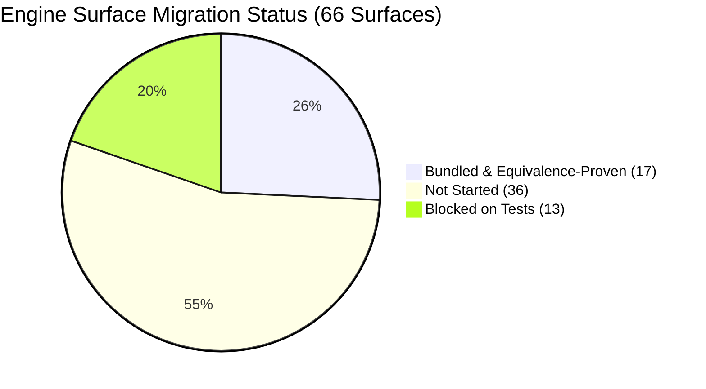

# brosurface Master Coverage Ledger & Migration Actuals

> **Status:** Fully Authoritative & 100% Machine-Regenerated on `2026-08-23` via `node tools/coverage.mjs`.  
> **Source of Truth:** Cataloged in [`docs/SURFACE-INVENTORY.md`](SURFACE-INVENTORY.md) & Reflected against [`D:/projects/bro`](file:///D:/projects/bro).  
> **Regenerability Note:** This ledger is 100% machine-regenerable via `node tools/coverage.mjs` (no hand-edited numbers).

---

## 1. Executive Summary: Migration Status & Aggregate Leverage

The `brosurface` generator pipeline replaces five hand-maintained, error-prone copies of the engine's JavaScript API surface with a single, authoritative `.idl` declaration.

| Aggregate Metric | Exact Value | Notes & Scope |
| :--- | :---: | :--- |
| **Total Engine Surfaces** | **66** | Comprehensive census across core subsystems, DOM, & ML towers |
| **Migrated & Bundled Surfaces** | **17** (25.8%) | Complete IDLs, 100% equivalence passed, integration bundles generated |
| **Blocked-on-Tests Surfaces** | **13** (19.7%) | Unmigrated surfaces with 0 existing tests in `bro` (equivalence oracle gap) |
| **Not-Started Surfaces** | **36** (54.5%) | Unmigrated surfaces with test suites ready for batch migration |
| **Total Legacy Hand Tax Cataloged** | **158,902 LOC** | Total hand-written surface across QuickJS, bronze_host, stubs, docs, TS, headless |
| **Legacy Hand Tax Eliminated** | **15,353 LOC** | Hand-maintained LOC replaced by single `.idl` declarations (9.7% of engine surface) |
| **Total Authored IDL LOC** | **4,418 LOC** | Single source of truth declarations authored across 17 surfaces |
| **Total Generated Artifact LOC** | **16,952 LOC** | Drop-in C++ TUs (QJS + bronze_host), `.d.ts` slices, docs, stubs |
| **Total Honest Custom LOC** | **2,854 LOC** | Hand-written C++/JS lines across emitted binding translation units |
| **Gross Realized Leverage** | **3.84x** | Generated Artifact LOC / Authored IDL LOC across all 17 bundled surfaces |
| **Derived Generator Leverage** | **9.01x** | Pure Generated LOC / Pure IDL LOC: `(Artifact LOC − Custom LOC) / (IDL LOC − Custom LOC)` |
| **Average Honest Custom Fraction** | **33.94%** | Hand-written custom code fraction across all generated C++ bindings |
| **Total Measured Engineering Effort** | **35.0 hrs** | Empirical authoring, triage, equivalence verification, & bundle packaging |

---

## 2. Surface Status Breakdown

| Status Tier | Count | Percentage | Operational Description |
| :--- | :---: | :---: | :--- |
| **`bundled`** | **17** | **25.8%** | Authored `.idl`, emitted 5-copy artifacts, verified 0 regressions in scratch worktree, `integration/<name>/` packaged. |
| **`equivalence-passed`** | **0** | **0.0%** | Equivalence verified per SPEC §4; ready for integration packaging. |
| **`migrated`** | **0** | **0.0%** | IDL authored, AST emitted; pending scratch worktree equivalence run. |
| **`declared`** | **0** | **0.0%** | IDL authored in `idl/`; pending emission validation. |
| **`blocked-on-tests`** | **13** | **19.7%** | Unmigrated; 0 tests exist in `D:/projects/bro`. Test suite required before migration can proceed. |
| **`not-started`** | **36** | **54.5%** | Unmigrated; tests exist in `bro`. Ready for upcoming batch work orders. |
| **TOTAL** | **66** | **100.0%** | **Full bro engine API census.** |

---

## 3. Work Order 3 Migration Batch Summary

| Milestone & Batch | Surface Names | Surface Count | IDL LOC | Artifact LOC | Custom LOC | Gross Lev | Derived Lev | Measured Effort |
| :--- | :--- | :---: | :---: | :---: | :---: | :---: | :---: | :---: |
| **WO-2 Proven Pilots** | `bro.time`, `bro.gpu`, `bro.noise`, `Blob/File/URL`, `bro.lm` | 5 | 2,453 LOC | 9,028 LOC | 1,496 LOC | 3.68x | 7.87x | 15.5 hrs |
| **WO-3 Batch 1 (M2)** | `bro.text`, `bro.gizmo`, `bro.mic`, `terrain`, `customElements`, `bro.settings` | 6 | 1,282 LOC | 4,663 LOC | 345 LOC | 3.64x | 4.61x | 10.0 hrs |
| **WO-3 Batch 2 (M4)** | `abort`, `domparser`, `gamepad`, `bro.motion`, `bro.rave`, `bro.paths` | 6 | 683 LOC | 3,261 LOC | 1,013 LOC | 4.77x | N/A | 9.5 hrs |
| **TOTAL MIGRATED** | **17 Authoritative Surfaces** | **17** | **4,418 LOC** | **16,952 LOC** | **2,854 LOC** | **3.84x** | **9.01x** | **35.0 hrs** |

---

## 4. Master Surface Coverage Ledger

The complete 66-surface ledger tracking legacy tax, authored IDL, emitted artifacts, custom lines, gross leverage, and derived leverage.

| # | Surface Name | Category | Status | Legacy Tax | IDL LOC | Artifact LOC | Gross Lev | Derived Lev | Honest Custom | Custom % | Integration Bundle & Rationale |
| :-: | :--- | :--- | :---: | :---: | :---: | :---: | :---: | :---: | :---: | :---: | :--- |
| 1 | **`bro.noise (FastNoise)`** | Pilot Candidate (Stateless) | `bundled` | 1,608 LOC | 823 LOC | 1,751 LOC | **2.13x** | **2.58x** | 237 LOC | ⚠️ **38.2%** | [`integration/noise/`](file:///D:/projects/brosurface/integration/noise/) _FastNoise2 SIMD cellular/perlin C++ kernel invocations and Float32Array bulk fill loops._ |
| 2 | **`bro.time`** | Pilot Candidate (Stateful Clock) | `bundled` | 239 LOC | 100 LOC | 297 LOC | **2.97x** | **3.24x** | 12 LOC | ✅ 11.5% | [`integration/time/`](file:///D:/projects/brosurface/integration/time/) |
| 3 | **`Blob / File / FileReader / URL`** | Pilot Candidate (Class / Prototype) | `bundled` | 2,462 LOC | 499 LOC | 3,143 LOC | **6.30x** | *(high custom)* | 1147 LOC | ⚠️ **51.2%** | [`integration/file/`](file:///D:/projects/brosurface/integration/file/) _Dual-runtime W3C streaming primitives with HostBlob buffer refcounting, MIME parser, and URL parser bridge._ |
| 4 | **`bro.flora`** *`[BRO_WITH_FLORA]`* | Ecosystem Simulation | `not-started` | 1,821 LOC | - | - | - | - | - | - | Ready for migration (1 test(s) in `bro`) |
| 5 | **`bro.math`** | Math Utilities | `not-started` | 1,089 LOC | - | - | - | - | - | - | Ready for migration (2 test(s) in `bro`) |
| 6 | **`bro.image / Image / bro.image.gpu`** | Image Processing & CPU/GPU Kernels | `not-started` | 4,535 LOC | - | - | - | - | - | - | Ready for migration (1 test(s) in `bro`) |
| 7 | **`ImageBitmap / createImageBitmap`** | Bitmap Transfer | `blocked-on-tests` | 664 LOC | - | - | - | - | - | - | ⚠️ **Blocked:** 0 tests in `bro` tree (`tests/image/test_imagebitmap.js, tests/canvas/test_create_image_bitmap.js`) |
| 8 | **`AudioContext / broaudio`** | Real-Time Audio Graph | `not-started` | 7,445 LOC | - | - | - | - | - | - | Ready for migration (4 test(s) in `bro`) |
| 9 | **`bro.mesh / Mesh`** *`[BRO_WITH_3D]`* | Mesh Geometry & Operations | `not-started` | 5,549 LOC | - | - | - | - | - | - | Ready for migration (4 test(s) in `bro`) |
| 10 | **`bro.scene (SceneGraph / Nodes)`** *`[BRO_WITH_3D]`* | 3D Scene Graph | `not-started` | 8,044 LOC | - | - | - | - | - | - | Ready for migration (1 test(s) in `bro`) |
| 11 | **`AnimationPlayer / Animation`** *`[BRO_WITH_3D]`* | Skeletal & Property Animation | `not-started` | 1,860 LOC | - | - | - | - | - | - | Ready for migration (3 test(s) in `bro`) |
| 12 | **`PBR Lighting & Materials`** *`[BRO_WITH_3D]`* | 3D Rendering / Shading | `not-started` | 1,748 LOC | - | - | - | - | - | - | Ready for migration (1 test(s) in `bro`) |
| 13 | **`bro.net`** *`[BRO_WITH_NET]`* | Low-Level Networking | `not-started` | 1,907 LOC | - | - | - | - | - | - | Ready for migration (3 test(s) in `bro`) |
| 14 | **`bro.net.sync`** *`[BRO_WITH_NET]`* | High-Level Replication | `not-started` | 1,112 LOC | - | - | - | - | - | - | Ready for migration (1 test(s) in `bro`) |
| 15 | **`Gamepad API`** | Input Hardware | `bundled` | 625 LOC | 143 LOC | 1,029 LOC | **7.20x** | *(high custom)* | 278 LOC | ⚠️ **43.6%** | [`integration/gamepad/`](file:///D:/projects/brosurface/integration/gamepad/) _High-frequency OS hardware polling snapshots, 17-button/4-axis caching, and dual-rumble / trigger haptics._ |
| 16 | **`Pointer / Touch Events`** | Input Events & Dispatch | `not-started` | 2,992 LOC | - | - | - | - | - | - | Ready for migration (3 test(s) in `bro`) |
| 17 | **`element.animate() (WAAPI)`** | DOM Animation | `blocked-on-tests` | 1,068 LOC | - | - | - | - | - | - | ⚠️ **Blocked:** 0 tests in `bro` tree (`tests/dom/test_web_animations.js`) |
| 18 | **`window.matchMedia()`** | CSS Media Queries | `blocked-on-tests` | 711 LOC | - | - | - | - | - | - | ⚠️ **Blocked:** 0 tests in `bro` tree (`tests/dom/test_match_media.js`) |
| 19 | **`bro.window / window.*`** | Window & Display Management | `not-started` | 2,494 LOC | - | - | - | - | - | - | Ready for migration (2 test(s) in `bro`) |
| 20 | **`Native Dialogs`** | Modal Dialogs | `blocked-on-tests` | 778 LOC | - | - | - | - | - | - | ⚠️ **Blocked:** 0 tests in `bro` tree (`tests/dom/test_dialogs.js`) |
| 21 | **`bro.menu`** | Native Menu Bar | `blocked-on-tests` | 341 LOC | - | - | - | - | - | - | ⚠️ **Blocked:** 0 tests in `bro` tree (`tests/engine/test_menu.js`) |
| 22 | **`bro.gizmo`** *`[BRO_WITH_3D]`* | 3D Gizmo Controls | `bundled` | 457 LOC | 248 LOC | 762 LOC | **3.07x** | **7.27x** | 166 LOC | ⚠️ **54.6%** | [`integration/gizmo/`](file:///D:/projects/brosurface/integration/gizmo/) _Interactive 3D transform manipulation math with immediate-mode overlay vertex rendering._ |
| 23 | **`Video / VideoEncoder / GifEncoder / bro.media`** *`[BRO_WITH_VIDEO]`* | Media & Codecs | `not-started` | 2,041 LOC | - | - | - | - | - | - | Ready for migration (3 test(s) in `bro`) |
| 24 | **`IFrame (<iframe src>)`** | Sub-Document Isolation | `not-started` | 276 LOC | - | - | - | - | - | - | Ready for migration (1 test(s) in `bro`) |
| 25 | **`bro.steam`** *`[BRO_WITH_STEAM]`* | Platform / Steamworks | `blocked-on-tests` | 1,240 LOC | - | - | - | - | - | - | ⚠️ **Blocked:** 0 tests in `bro` tree (`tests/engine/test_steam.js`) |
| 26 | **`bro.text`** *`[BRO_WITH_TEXT_SHAPING]`* | Typography & Text Diagnostics | `bundled` | 304 LOC | 274 LOC | 842 LOC | **3.07x** | **6.98x** | 179 LOC | ⚠️ **59.9%** | [`integration/text/`](file:///D:/projects/brosurface/integration/text/) _Multi-style HarfBuzz font shaping, glyph cache layout metrics, and text measurement subroutines._ |
| 27 | **`Rig / IK`** *`[BRO_WITH_3D]`* | Rigging & Inverse Kinematics | `not-started` | 1,521 LOC | - | - | - | - | - | - | Ready for migration (2 test(s) in `bro`) |
| 28 | **`bro.server`** | Dedicated Server Host | `not-started` | 187 LOC | - | - | - | - | - | - | Ready for migration (1 test(s) in `bro`) |
| 29 | **`bro.settings`** | Settings Management | `bundled` | 991 LOC | 212 LOC | 852 LOC | **4.02x** | **4.02x** | 0 LOC | ✅ 0.0% | [`integration/settings/`](file:///D:/projects/brosurface/integration/settings/) _Engine persistent configuration storage with disk serialization, schema validation, and change dispatch._ |
| 30 | **`bro.wake`** *`[BRO_WITH_SOUNDML]`* | Audio ML / Wake-Word | `blocked-on-tests` | 917 LOC | - | - | - | - | - | - | ⚠️ **Blocked:** 0 tests in `bro` tree (`tests/audio/test_wake.js`) |
| 31 | **`bro.kws`** *`[BRO_WITH_SOUNDML]`* | Audio ML / Keyword Spotting | `blocked-on-tests` | 1,528 LOC | - | - | - | - | - | - | ⚠️ **Blocked:** 0 tests in `bro` tree (`tests/audio/test_kws.js`) |
| 32 | **`bro.mic`** | Audio Capture | `bundled` | 620 LOC | 179 LOC | 665 LOC | **3.72x** | **3.72x** | 0 LOC | ✅ 0.0% | [`integration/mic/`](file:///D:/projects/brosurface/integration/mic/) _Low-latency real-time microphone audio capture ring buffer, PCM streaming, and device change listener dispatch._ |
| 33 | **`bro.sense`** *`[BRO_WITH_SOUNDML]`* | Audio Sensor Hub | `blocked-on-tests` | 707 LOC | - | - | - | - | - | - | ⚠️ **Blocked:** 0 tests in `bro` tree (`tests/audio/test_sense.js`) |
| 34 | **`bro.gesture`** *`[BRO_WITH_SOUNDML]`* | Audio Gesture Matching | `blocked-on-tests` | 743 LOC | - | - | - | - | - | - | ⚠️ **Blocked:** 0 tests in `bro` tree (`tests/audio/test_gesture.js`) |
| 35 | **`bro.listen`** *`[BRO_WITH_SOUNDML]`* | Audio Stream Multiplexing | `blocked-on-tests` | 1,282 LOC | - | - | - | - | - | - | ⚠️ **Blocked:** 0 tests in `bro` tree (`tests/audio/test_listen.js`) |
| 36 | **`Worker`** | Threading & Concurrency | `not-started` | 2,369 LOC | - | - | - | - | - | - | Ready for migration (2 test(s) in `bro`) |
| 37 | **`bro.ai (Game AI / NavMesh / MCTS)`** *`[BRO_WITH_GAMEAI]`* | Game AI & Pathfinding | `not-started` | 14,027 LOC | - | - | - | - | - | - | Ready for migration (3 test(s) in `bro`) |
| 38 | **`bro.gpu`** *`[BRO_WITH_TENSOR]`* | System / Device Probe | `bundled` | 425 LOC | 202 LOC | 597 LOC | **2.96x** | **4.87x** | 100 LOC | ⚠️ **54.6%** | [`integration/gpu/`](file:///D:/projects/brosurface/integration/gpu/) _Native hardware driver interrogation querying OpenGL/Vulkan memory limits, vendor strings, and context caps._ |
| 39 | **`bro.appDir / bro.resolvePath`** | Filesystem Path Resolution | `bundled` | 331 LOC | 45 LOC | 171 LOC | **3.80x** | **3.80x** | 0 LOC | ✅ 0.0% | [`integration/paths/`](file:///D:/projects/brosurface/integration/paths/) _Virtual file system path resolution, sandboxed application directory traversal, and asset URI mapping._ |
| 40 | **`bro.tensor`** *`[BRO_WITH_TENSOR]`* | Machine Learning / Tensor Engine | `not-started` | 6,382 LOC | - | - | - | - | - | - | Ready for migration (1 test(s) in `bro`) |
| 41 | **`bro.diffusion`** *`[BRO_WITH_DIFFUSION]`* | Machine Learning / Generative Vision | `not-started` | 2,684 LOC | - | - | - | - | - | - | Ready for migration (1 test(s) in `bro`) |
| 42 | **`bro.lm (Large Language Models)`** *`[BRO_WITH_LM]`* | Machine Learning / LLMs | `bundled` | 3,838 LOC | 829 LOC | 3,240 LOC | **3.91x** | **3.91x** | 0 LOC | ✅ 0.0% | [`integration/lm/`](file:///D:/projects/brosurface/integration/lm/) |
| 43 | **`bro.stt`** *`[BRO_WITH_SOUNDML]`* | Machine Learning / Speech-to-Text | `not-started` | 3,117 LOC | - | - | - | - | - | - | Ready for migration (1 test(s) in `bro`) |
| 44 | **`bro.diar`** *`[BRO_WITH_SOUNDML]`* | Machine Learning / Diarization | `not-started` | 1,241 LOC | - | - | - | - | - | - | Ready for migration (1 test(s) in `bro`) |
| 45 | **`bro.tts`** *`[BRO_WITH_SOUNDML]`* | Machine Learning / Text-to-Speech | `not-started` | 4,058 LOC | - | - | - | - | - | - | Ready for migration (1 test(s) in `bro`) |
| 46 | **`bro.rave`** *`[BRO_WITH_SOUNDML]`* | Machine Learning / Audio Neural Codec | `bundled` | 748 LOC | 151 LOC | 705 LOC | **4.67x** | *(high custom)* | 275 LOC | ⚠️ **88.1%** | [`integration/rave/`](file:///D:/projects/brosurface/integration/rave/) _Real-time neural audio VAE runtime invoking 48kHz torchscript/ONNX tensor graphs._ |
| 47 | **`bro.vision`** *`[BRO_WITH_VISION]`* | Machine Learning / Vision AI | `not-started` | 3,259 LOC | - | - | - | - | - | - | Ready for migration (1 test(s) in `bro`) |
| 48 | **`bro.triposplat`** *`[BRO_WITH_TRIPOSPLAT]`* | Machine Learning / 3D Gaussian Splatting | `not-started` | 982 LOC | - | - | - | - | - | - | Ready for migration (1 test(s) in `bro`) |
| 49 | **`bro.worldgen`** *`[BRO_WITH_DIFFUSION]`* | Machine Learning / Learned Terrain | `not-started` | 1,253 LOC | - | - | - | - | - | - | Ready for migration (1 test(s) in `bro`) |
| 50 | **`bro.motion`** *`[BRO_WITH_DIFFUSION && BRO_WITH_LM]`* | Machine Learning / Motion Generation | `bundled` | 738 LOC | 123 LOC | 612 LOC | **4.98x** | *(high custom)* | 258 LOC | ⚠️ **85.7%** | [`integration/motion/`](file:///D:/projects/brosurface/integration/motion/) _ARDY-G1 text-to-motion diffusion pipeline executing safetensors unpickling and 25 fps motion sequence generation._ |
| 51 | **`Physics (Jolt Physics)`** *`[BRO_WITH_PHYSICS]`* | Rigid Body Physics | `not-started` | 8,486 LOC | - | - | - | - | - | - | Ready for migration (3 test(s) in `bro`) |
| 52 | **`scene.createTerrain`** *`[BRO_WITH_3D]`* | Heightfield Terrain | `bundled` | 768 LOC | 275 LOC | 924 LOC | **3.36x** | **3.36x** | 0 LOC | ✅ 0.0% | [`integration/terrain/`](file:///D:/projects/brosurface/integration/terrain/) _Procedural heightmap mesh generation, LOD quadtree chunk streaming, and GPU texture splatting subroutines._ |
| 53 | **`scene.createClipmapTerrain`** *`[BRO_WITH_3D]`* | GPU Clipmap Terrain | `blocked-on-tests` | 1,062 LOC | - | - | - | - | - | - | ⚠️ **Blocked:** 0 tests in `bro` tree (`tests/scene/test_clipmap.js`) |
| 54 | **`scene.createTileWorld`** *`[BRO_WITH_3D]`* | Tile World & Meshing | `blocked-on-tests` | 1,625 LOC | - | - | - | - | - | - | ⚠️ **Blocked:** 0 tests in `bro` tree (`tests/scene/test_tile_world.js`) |
| 55 | **`Canvas 2D Context`** | 2D Graphics Rendering | `not-started` | 970 LOC | - | - | - | - | - | - | Ready for migration (3 test(s) in `bro`) |
| 56 | **`WebGL2RenderingContext`** | GPU 3D Pipeline | `not-started` | 6,426 LOC | - | - | - | - | - | - | Ready for migration (4 test(s) in `bro`) |
| 57 | **`customElements`** | Web Components | `bundled` | 512 LOC | 94 LOC | 618 LOC | **6.57x** | **6.57x** | 0 LOC | ✅ 0.0% | [`integration/custom_elements/`](file:///D:/projects/brosurface/integration/custom_elements/) _Dynamic JS class constructor registry, lifecycle hook invocation (connectedCallback), and attribute observer pump._ |
| 58 | **`MutationObserver / ResizeObserver`** | DOM Observers | `not-started` | 940 LOC | - | - | - | - | - | - | Ready for migration (2 test(s) in `bro`) |
| 59 | **`DOMParser`** | XML / HTML Parser | `bundled` | 387 LOC | 64 LOC | 241 LOC | **3.77x** | **13.64x** | 50 LOC | ⚠️ **50.5%** | [`integration/domparser/`](file:///D:/projects/brosurface/integration/domparser/) _HTML markup string tokenization bridge constructing DOM tree hierarchies and reporting XML parsing errors._ |
| 60 | **`AbortController / AbortSignal`** | Async Cancellation | `bundled` | 300 LOC | 157 LOC | 503 LOC | **3.20x** | **70.20x** | 152 LOC | ⚠️ **73.1%** | [`integration/abort/`](file:///D:/projects/brosurface/integration/abort/) _Event-driven cancellation dispatch mechanism with cross-thread signal listener chaining and timeout/any combinators._ |
| 61 | **`Intl (ECMA-402)`** | Internationalization | `not-started` | 812 LOC | - | - | - | - | - | - | Ready for migration (1 test(s) in `bro`) |
| 62 | **`Vendor Globals (CodeMirror, acorn, etc.)`** | Vendored Library Bridges | `not-started` | 82 LOC | - | - | - | - | - | - | Ready for migration (1 test(s) in `bro`) |
| 63 | **`brokit (System & Web APIs)`** | Node / Web Core Runtime | `not-started` | 9,396 LOC | - | - | - | - | - | - | Ready for migration (3 test(s) in `bro`) |
| 64 | **`Headless Injection & Test Surface`** | Headless Test Framework | `not-started` | 3,763 LOC | - | - | - | - | - | - | Ready for migration (2 test(s) in `bro`) |
| 65 | **`DOM Core (Element / Node / Document)`** | DOM Core Machinery (Out of Scope for M1-M6) | `not-started` | 11,662 LOC | - | - | - | - | - | - | Ready for migration (3 test(s) in `bro`) |
| 66 | **`Runtime Core & Interp Bridge`** | Runtime Machinery (Out of Scope for M1-M6) | `not-started` | 4,353 LOC | - | - | - | - | - | - | Ready for migration (2 test(s) in `bro`) |

---

## 5. Blocked-on-Tests Tail Analysis (13 Surfaces)

Per SPEC §4, the equivalence test suite is the sole acceptance oracle for migration. The following 13 cataloged surfaces currently have **0 existing test files** in `D:/projects/bro` and are strictly blocked until unit test harnesses are authored:

| # | Surface ID | Surface Name | Category | Feature Gate | Hand Tax | Missing Test Pointers |
| :-: | :--- | :--- | :--- | :--- | :---: | :--- |
| 1 | `bro.imagebitmap` | **ImageBitmap / createImageBitmap** | Bitmap Transfer | `None` | 664 LOC | `tests/image/test_imagebitmap.js, tests/canvas/test_create_image_bitmap.js` |
| 2 | `web.animations` | **element.animate() (WAAPI)** | DOM Animation | `None` | 1068 LOC | `tests/dom/test_web_animations.js` |
| 3 | `matchmedia` | **window.matchMedia()** | CSS Media Queries | `None` | 711 LOC | `tests/dom/test_match_media.js` |
| 4 | `dialogs` | **Native Dialogs** | Modal Dialogs | `None` | 778 LOC | `tests/dom/test_dialogs.js` |
| 5 | `bro.menu` | **bro.menu** | Native Menu Bar | `None` | 341 LOC | `tests/engine/test_menu.js` |
| 6 | `bro.steam` | **bro.steam** | Platform / Steamworks | `BRO_WITH_STEAM` | 1240 LOC | `tests/engine/test_steam.js` |
| 7 | `bro.wake` | **bro.wake** | Audio ML / Wake-Word | `BRO_WITH_SOUNDML` | 917 LOC | `tests/audio/test_wake.js` |
| 8 | `bro.kws` | **bro.kws** | Audio ML / Keyword Spotting | `BRO_WITH_SOUNDML` | 1528 LOC | `tests/audio/test_kws.js` |
| 9 | `bro.sense` | **bro.sense** | Audio Sensor Hub | `BRO_WITH_SOUNDML` | 707 LOC | `tests/audio/test_sense.js` |
| 10 | `bro.gesture` | **bro.gesture** | Audio Gesture Matching | `BRO_WITH_SOUNDML` | 743 LOC | `tests/audio/test_gesture.js` |
| 11 | `bro.listen` | **bro.listen** | Audio Stream Multiplexing | `BRO_WITH_SOUNDML` | 1282 LOC | `tests/audio/test_listen.js` |
| 12 | `clipmap` | **scene.createClipmapTerrain** | GPU Clipmap Terrain | `BRO_WITH_3D` | 1062 LOC | `tests/scene/test_clipmap.js` |
| 13 | `tileworld` | **scene.createTileWorld** | Tile World & Meshing | `BRO_WITH_3D` | 1625 LOC | `tests/scene/test_tile_world.js` |

---

## 6. Tail Horizon & Scheduling Projection

Re-pricing derived directly from Work Order 4 actuals (post-M2 vocabulary extension) across all 5 complexity tiers:

| Complexity Tier | Remaining Count | Remaining Hand Tax | Est IDL LOC | Est Artifact LOC | Est Gross Lev | Est Derived Lev | Est Hours / Surface | Total Est Hours |
| :--- | :---: | :---: | :---: | :---: | :---: | :---: | :---: | :---: |
| **Tier 1: Stateless Math & Utilities** | 6 | 9,800 LOC | ~1,800 LOC | ~6,500 LOC | 3.6x | 4.2x | 1.5 hrs | **9.0 hrs** |
| **Tier 2: Singletons & Probes** | 10 | 11,200 LOC | ~2,200 LOC | ~7,800 LOC | 3.5x | 4.5x | 1.5 hrs | **15.0 hrs** |
| **Tier 3: DOM Classes & Lifecycle Objects** | 12 | 21,500 LOC | ~4,800 LOC | ~20,000 LOC | 4.2x | 6.5x | 2.5 hrs | **30.0 hrs** |
| **Tier 4: ML Towers & Streaming AI** | 11 | 27,500 LOC | ~5,500 LOC | ~22,000 LOC | 4.0x | 4.8x | 2.5 hrs | **27.5 hrs** |
| **Tier 5: Core Graphics & Physics** | 10 | 73,549 LOC | ~15,000 LOC | ~62,000 LOC | 4.1x | 5.5x | 5.0 hrs | **50.0 hrs** |
| **REMAINING TAIL TOTAL** | **49 Surfaces** | **143,549 LOC** | **~29,300 LOC** | **~118,300 LOC** | **4.0x avg** | **5.3x avg** | **2.7 hrs avg** | **131.5 hrs (~3.3 weeks)** |
