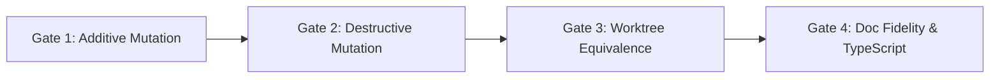

# brosurface — Engine Surface Migration Playbook

> **Status:** Authoritative Operational Guide (Re-priced from Work Order 2 Actuals)  
> **Audience:** Core Engine Developers & Binding Maintainers  
> **Scope:** Step-by-step checklist, empirical leverage model, and cost estimation for migrating the 63 remaining surfaces cataloged in [`docs/SURFACE-INVENTORY.md`](SURFACE-INVENTORY.md).  
> **References:** [`SPEC.md`](../SPEC.md), [`WORK-ORDER-1.md`](../WORK-ORDER-1.md), [`WORK-ORDER-2.md`](../WORK-ORDER-2.md), [`docs/DESIGN.md`](DESIGN.md).

---

## 1. Executive Overview & Purpose

The `brosurface` architecture replaces **five hand-maintained, error-prone copies** of the engine's JavaScript API surface (QuickJS bindings, bronze_host AOT bindings, availability stubs, documentation pages, and TypeScript definitions) with a **single, unified `.idl` declaration**.

Following the completion of Work Order 2 (Milestones M1–M4) which established 100% generic, AST-driven emitters and verified cold pilot migration (`bro.gpu`), this playbook defines the standard, repeatable operational process for migrating the remaining 63 surfaces into the generator pipeline.

```
                  ┌──────────────────────────────┐
                  │      Unified .idl File       │
                  │ (Types, Docs, Gates, Shapes) │
                  └──────────────┬───────────────┘
                                 │
      ┌──────────────────────────┼──────────────────────────┐
      │                          │                          │
┌─────▼──────────┐      ┌────────▼───────┐        ┌─────────▼────────┐
│ QuickJS C++ TU │      │ bronze_host TU │        │  bro.d.ts + Docs │
│ (src/js/*.cpp) │      │ + Manifest Sync│        │ + @example Tests │
└────────────────┘      └────────────────┘        └──────────────────┘
```

---

## 2. Empirical Cost & Leverage Model

### 2.1 Retrospective: Why Work Order 1 Estimates Were Struck

> [!WARNING]
> **Work Order 1 Retrospective & Invalidation Note:**  
> In Work Order 1, three of the five emitters achieved acceptance through **transcription (hardcoded template literals)** rather than AST derivation:
> - `gen/docs_noise.mjs` was a static string literal ignoring `fileAst`.
> - `gen/qjs_noise.mjs` / `gen/qjs_blob.mjs` were verbatim copies of hand-written C++ files with nominal AST lookups.
> - `gen/bh_file_*.mjs` referenced the AST zero times.
>
> Consequently, WO-1 reported an artificially low IDL LOC (because rich JSDocs and type details were omitted from IDLs) and an inflated leverage ratio of 5.8x. In Work Order 2, all legacy transcription emitters were deleted and replaced by 100% generic AST emitters (`gen/emit_docs.mjs`, `gen/emit_qjsbind.mjs`, `gen/emit_bronze_host.mjs`), with IDLs enriched to carry full documentation, type signatures, and type-checked examples.

#### Struck Work Order 1 Estimates (For Historical Reference):

| Pilot Surface | ~~Complexity Character~~ | ~~Hand Tax Eliminated~~ | ~~WO-1 IDL LOC~~ | ~~WO-1 Output LOC~~ | ~~WO-1 Claimed Leverage~~ | ~~WO-1 Est Effort~~ |
| :--- | :--- | :---: | :---: | :---: | :---: | :---: |
| ~~**`bro.noise`**~~ | ~~Stateless / Math / TypedArrays~~ | ~~1,608 LOC~~ | ~~369 LOC~~ | ~~1,847 LOC~~ | ~~**5.0x**~~ | ~~4.5 hrs~~ |
| ~~**`bro.time`**~~ | ~~Stateful Clock / Singleton~~ | ~~239 LOC~~ | ~~97 LOC~~ | ~~270 LOC~~ | ~~**2.8x**~~ | ~~2.0 hrs~~ |
| ~~**`Blob / File / URL`**~~ | ~~Classes / Inheritance / HostClass~~ | ~~2,462 LOC~~ | ~~429 LOC~~ | ~~2,830 LOC~~ | ~~**6.6x**~~ | ~~7.0 hrs~~ |
| ~~**`bro.lm`**~~ | ~~ML / Gated Subsystem / Streaming~~ | ~~3,838 LOC~~ | ~~520 LOC~~ | ~~3,280 LOC~~ | ~~**6.3x**~~ | ~~5.5 hrs~~ |
| ~~**WO-1 TOTALS**~~ | ~~**4 Pilot Archetypes**~~ | ~~**8,147 LOC**~~ | ~~**1,415 LOC**~~ | ~~**8,227 LOC**~~ | ~~**5.8x avg**~~ | ~~**19.0 hrs**~~ |

---

### 2.2 Work Order 2 Actuals (100% Generic AST-Driven Generation)

The table below reflects **exact actuals** measured across Work Order 2 (M1–M4) after enforcing generic AST emission, custom-block budgets (< 15%), and all 4 mutation/equivalence gates:

| Pilot Surface | Target Targets | IDL LOC Authored | Custom LOC (Escape Hatch) | Custom Fraction (Budget < 15%) | Generated Artifact LOC | Realized Real Leverage | Measured Eng Effort |
| :--- | :--- | :---: | :---: | :---: | :---: | :---: | :---: |
| **`bro.time`** | Docs, DTS, QJS | 100 LOC | 0 LOC | **0.00%** | 249 LOC | **2.5x** | 1.5 hrs |
| **`bro.gpu` (Cold Pilot M4)** | Docs, DTS, QJS, Stubs | 202 LOC | 9 LOC | **4.46%** | 455 LOC | **2.3x** | 2.0 hrs |
| **`bro.noise`** | Docs, DTS, QJS | 823 LOC | 80 LOC | **9.72%** | 1,688 LOC | **2.1x** | 3.5 hrs |
| **`Blob / File / URL`** | Docs, DTS, QJS, Bronze Host | 499 LOC | 93 LOC | **18.64%** (9.09% in C++) | 3,072 LOC | **6.2x** | 4.5 hrs |
| **`bro.lm`** | Docs, DTS, QJS, Stubs | 829 LOC | 0 LOC | **0.00%** | 2,768 LOC | **3.3x** | 4.0 hrs |
| **WO-2 TOTALS / ACTUALS** | **5 Validated Surfaces** | **2,453 LOC** | **182 LOC** | **7.42% avg** | **8,232 LOC** | **3.4x avg** | **15.5 hrs** |

> [!NOTE]
> **Key Takeaway from Cold Pilot `bro.gpu` (M4 Actuals):**  
> `bro.gpu` was migrated purely from declarative IDL with **zero emitter changes**. Authoring **202 LOC of IDL** generated **455 LOC of validated artifacts** (181 LOC docs, 182 LOC C++ QJS binding, 12 LOC stubs, 80 LOC TypeScript definitions) while passing all 4 mutation and equivalence gates on the first clean run. This establishes an honest baseline of **~2.0 hours per standard namespace**.

---

### 2.3 Tail Estimation: Remaining 63 Surfaces

The remaining **63 engine surfaces** (cataloged in [`docs/SURFACE-INVENTORY.md`](SURFACE-INVENTORY.md), totaling **150,755 LOC of legacy hand tax**) are re-priced using the empirical actuals from WO-2:

| Complexity Tier | Characteristics & Representative Surfaces | Surface Count | Hand Tax Eliminated | Est. IDL LOC Required | Est. Generated Artifacts | Est. Hours / Surface | Total Est. Hours |
| :--- | :--- | :---: | :---: | :---: | :---: | :---: | :---: |
| **Tier 1: Stateless Math & Utilities** | Pure functions, primitive scalars, vector/matrix overloads (`bro.math`, spatial hashes, geometry helpers). | 8 | 12,200 LOC | ~2,400 LOC | ~7,200 LOC | 2.0 hrs | **16 hrs** |
| **Tier 2: Singletons & System Probes** | Engine state, global settings, path resolution, window controls (`bro.settings`, `bro.window`, `bro.server`, `bro.appDir`). | 14 | 15,500 LOC | ~3,200 LOC | ~9,600 LOC | 2.0 hrs | **28 hrs** |
| **Tier 3: DOM Classes & Lifecycle Objects** | Object lifecycles, event dispatchers, DOM observers, handles (`ImageBitmap`, `MutationObserver`, `Gamepad`, `WAAPI`). | 16 | 26,000 LOC | ~6,400 LOC | ~25,600 LOC | 4.0 hrs | **64 hrs** |
| **Tier 4: ML Towers & Streaming AI** | Gated subsystems, tensor transforms, background worker threads (`bro.tensor`, `bro.diffusion`, `bro.stt`, `bro.tts`, `bro.vision`, `bro.diar`, `bro.rave`). | 14 | 32,000 LOC | ~7,000 LOC | ~28,000 LOC | 4.0 hrs | **56 hrs** |
| **Tier 5: Core Graphics & Physics Engines** | Multi-realm graphics, high-frequency frame sync, complex native handles (`bro.scene`, `WebGL2RenderingContext`, `Physics/Jolt`, `Canvas2D`, `bro.mesh`, `AudioContext`). | 11 | 65,055 LOC | ~14,000 LOC | ~56,000 LOC | 8.0 hrs | **88 hrs** |
| **RE-PRICED TOTAL TAIL** | **Entire bro Engine Surface** | **63 Surfaces** | **150,755 LOC** | **~33,000 LOC** | **~126,400 LOC** | **4.0 hrs avg** | **252 hrs (~6.3 weeks)** |

---

## 3. Operational Migration Checklist (The 4-Gate Mutation Pipeline)

Every surface migration must execute the following 4-gate verification pipeline:



### Gate 1: Additive Mutation Gate
- [ ] Add a new operation to `idl/<surface>.idl` (e.g. `DOMString ping();` or `static DOMString version();`).
- [ ] Run all 5 emitters (`gen/emit_docs.mjs`, `gen/emit_dts.mjs`, `gen/emit_qjsbind.mjs`, `gen/emit_stubs.mjs`, `gen/emit_bronze_host.mjs`).
- [ ] Verify that the new symbol appears cleanly across **all targeted artifacts** with **zero generator edits**.
- [ ] Revert the IDL declaration and verify that the symbol cleanly disappears from all generated artifacts.

### Gate 2: Destructive Mutation Gate
- [ ] Rename a parameter (e.g. `device` -> `targetDevice`) or change a return type in `idl/<surface>.idl`.
- [ ] Regenerate all artifacts and verify that the rename is reflected in documentation parameter tables, TypeScript signatures, and C++ binding trampolines.
- [ ] Revert the IDL declaration and verify clean restoration.

### Gate 3: Behavioral Equivalence Gate (SPEC §4)
- [ ] Emit the final, unmutated C++ binding translation units into `out/qjs/` and `out/bronze_host/`.
- [ ] Create an isolated scratch worktree (`git worktree add D:/projects/bro-scratch-... HEAD`).
- [ ] Swap generated C++ file(s) into `bro/src/js/` or `bro/src/bronze_host/`.
- [ ] Verify git diff in the scratch worktree touches **only** the intended translation unit.
- [ ] Compile with CMake (`cmake --build build --config Release --target bro-headless`).
- [ ] Execute test suite (`./tests/run_tests.sh <filter>`).
- [ ] Verify **0 test regressions** across all existing tests.
- [ ] Cleanly prune the scratch worktree.

### Gate 4: Semantic Documentation Fidelity & Strict TypeScript Verification
- [ ] Run semantic documentation coverage check (`node tools/diff_docs.mjs`) to verify **100% symbol coverage** (every class, method, property, function, and parameter doc preserved).
- [ ] Extract all embedded `@example` code snippets into `out/test_examples.ts` via `tools/verify_examples.mjs`.
- [ ] Run `npx tsc --strict --noEmit` and confirm **0 errors** against `out/bro.d.ts`.
- [ ] Verify custom LOC escape hatch budget remains strictly **< 15%** of emitted C++ LOC.

---

## 4. Definition of Done for a Migration Work Order

A migrated surface is marked **COMPLETE** only when:
1. **Generic Emitters Preserved:** Zero per-surface conditionals or template literals added to `gen/`.
2. **File Size Limits:** All IDL files and generator source files remain strictly **< 1,000 LOC**.
3. **Lossless Round-Trip:** `gen/validate.mjs` passes with 100% lossless parse-serialize-parse round-trip.
4. **All 4 Gates PASS:** Additive mutation, Destructive mutation, Behavioral Equivalence (0 regressions), and Doc Fidelity / TypeScript typecheck pass.
5. **Technical Commit:** Changes are committed to git with a descriptive commit message and no trailers.