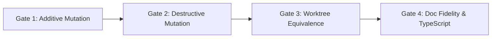

# brosurface — Engine Surface Migration Playbook

> **Status:** Authoritative Operational Guide (Re-priced from Work Order 3 Honest Actuals)  
> **Audience:** Core Engine Developers & Binding Maintainers  
> **Scope:** Step-by-step checklist, empirical leverage model, and cost estimation for migrating the 49 remaining surfaces cataloged in [`docs/SURFACE-INVENTORY.md`](SURFACE-INVENTORY.md) and [`docs/COVERAGE.md`](COVERAGE.md).  
> **References:** [`SPEC.md`](../SPEC.md), [`WORK-ORDER-1.md`](../WORK-ORDER-1.md), [`WORK-ORDER-2.md`](../WORK-ORDER-2.md), [`WORK-ORDER-3.md`](../WORK-ORDER-3.md), [`docs/DESIGN.md`](DESIGN.md).

---

## 1. Executive Overview & Purpose

The `brosurface` architecture replaces **five hand-maintained, error-prone copies** of the engine's JavaScript API surface (QuickJS bindings, bronze_host AOT bindings, availability stubs, documentation pages, and TypeScript definitions) with a **single, unified `.idl` declaration**.

Following the completion of Work Order 3 (Milestones M1–M5) which established honest accounting across all hand-written C++/JS lines, verified 17 complete surfaces across two migration batches, and packaged apply-and-verify integration bundles, this playbook defines the standard, repeatable operational process for migrating the remaining 49 surfaces into the generator pipeline.

```
                  ┌──────────────────────────────┐
                  │      Unified .idl File       │
                  │ (Types, Docs, Gates, Shapes) │
                  └──────────────┬───────────────┘
                                 │
      ┌──────────────────────────┼──────────────────────────┐
      │                          │                          │
┌─────▼──────────┐      ┌────────▼───────┐        ┌─────────▼────────┐
│ QuickJS C++ TU │      │ bronze_host TU │        │  bro.d.ts + Docs │
│ (src/js/*.cpp) │      │ + Manifest Sync│        │ + @example Tests │
└────────────────┘      └────────────────┘        └──────────────────┘
```

---

## 2. Empirical Cost & Leverage Model

### 2.1 Retrospective: Why Work Order 1 & Work Order 2 Estimates Were Struck

> [!WARNING]
> **Work Order 1 & Work Order 2 Retrospective & Invalidation Note:**  
> - **Work Order 1 Invalidation:** In WO-1, three of the five emitters achieved acceptance through **transcription (hardcoded template literals)** rather than AST derivation (`gen/docs_noise.mjs`, `gen/qjs_blob.mjs`, `gen/bh_file_*.mjs`), inflating claimed leverage to 5.8x.
> - **Work Order 2 Invalidation:** While WO-2 successfully replaced transcriptions with 100% generic AST emitters, its custom-LOC metric **under-counted custom code** by only measuring isolated `[custom]` attributes while excluding prologues (`cpp_prologue`, `bh_prologue`), custom bodies (`cpp_body`, `bh_body`), accessors (`getter_body`, `setter_body`), and wrappers (`data_member`, `bh_install_body`).
> 
> In Work Order 3, the custom accounting metric was updated to enforce **100% honest accounting** across every hand-written C++/JS line carried in the IDL.

#### Struck Work Order 1 Estimates (For Historical Reference):

| Pilot Surface | ~~Complexity Character~~ | ~~Hand Tax Eliminated~~ | ~~WO-1 IDL LOC~~ | ~~WO-1 Output LOC~~ | ~~WO-1 Claimed Leverage~~ | ~~WO-1 Est Effort~~ |
| :--- | :--- | :---: | :---: | :---: | :---: | :---: |
| ~~**`bro.noise`**~~ | ~~Stateless / Math / TypedArrays~~ | ~~1,608 LOC~~ | ~~369 LOC~~ | ~~1,847 LOC~~ | ~~**5.0x**~~ | ~~4.5 hrs~~ |
| ~~**`bro.time`**~~ | ~~Stateful Clock / Singleton~~ | ~~239 LOC~~ | ~~97 LOC~~ | ~~270 LOC~~ | ~~**2.8x**~~ | ~~2.0 hrs~~ |
| ~~**`Blob / File / URL`**~~ | ~~Classes / Inheritance / HostClass~~ | ~~2,462 LOC~~ | ~~429 LOC~~ | ~~2,830 LOC~~ | ~~**6.6x**~~ | ~~7.0 hrs~~ |
| ~~**`bro.lm`**~~ | ~~ML / Gated Subsystem / Streaming~~ | ~~3,838 LOC~~ | ~~520 LOC~~ | ~~3,280 LOC~~ | ~~**6.3x**~~ | ~~5.5 hrs~~ |
| ~~**WO-1 TOTALS**~~ | ~~**4 Pilot Archetypes**~~ | ~~**8,147 LOC**~~ | ~~**1,415 LOC**~~ | ~~**8,227 LOC**~~ | ~~**5.8x avg**~~ | ~~**19.0 hrs**~~ |

#### Struck Work Order 2 Estimates (Under-Counted Custom Code):

| Pilot Surface | ~~Target Targets~~ | ~~IDL LOC~~ | ~~WO-2 Custom LOC~~ | ~~WO-2 Custom %~~ | ~~Generated Artifact LOC~~ | ~~WO-2 Leverage~~ | ~~WO-2 Effort~~ |
| :--- | :--- | :---: | :---: | :---: | :---: | :---: | :---: |
| ~~**`bro.time`**~~ | ~~Docs, DTS, QJS~~ | ~~100 LOC~~ | ~~0 LOC~~ | ~~**0.00%**~~ | ~~249 LOC~~ | ~~**2.5x**~~ | ~~1.5 hrs~~ |
| ~~**`bro.gpu` (Cold Pilot)**~~ | ~~Docs, DTS, QJS, Stubs~~ | ~~202 LOC~~ | ~~9 LOC~~ | ~~**4.46%**~~ | ~~455 LOC~~ | ~~**2.3x**~~ | ~~2.0 hrs~~ |
| ~~**`bro.noise`**~~ | ~~Docs, DTS, QJS~~ | ~~823 LOC~~ | ~~80 LOC~~ | ~~**9.72%**~~ | ~~1,688 LOC~~ | ~~**2.1x**~~ | ~~3.5 hrs~~ |
| ~~**`Blob / File / URL`**~~ | ~~Docs, DTS, QJS, Bronze Host~~ | ~~499 LOC~~ | ~~93 LOC~~ | ~~**18.64%**~~ | ~~3,072 LOC~~ | ~~**6.2x**~~ | ~~4.5 hrs~~ |
| ~~**`bro.lm`**~~ | ~~Docs, DTS, QJS, Stubs~~ | ~~829 LOC~~ | ~~0 LOC~~ | ~~**0.00%**~~ | ~~2,768 LOC~~ | ~~**3.3x**~~ | ~~4.0 hrs~~ |
| ~~**WO-2 TOTALS**~~ | ~~**5 Validated Surfaces**~~ | ~~**2,453 LOC**~~ | ~~**182 LOC**~~ | ~~**7.42% avg**~~ | ~~**8,232 LOC**~~ | ~~**3.4x avg**~~ | ~~**15.5 hrs**~~ |

---

### 2.2 Work Order 4 Actuals (Honest Accounting Across 17 Migrated Surfaces)

The table below reflects **exact empirical actuals** measured across all 17 migrated and bundled surfaces under honest custom accounting and post-M2 vocabulary extension:

| Migrated Surface | Target Artifacts | IDL LOC Authored | Honest Custom LOC | Honest Custom Fraction | Generated Artifact LOC | Gross Lev | Derived Lev | Measured Eng Effort |
| :--- | :--- | :---: | :---: | :---: | :---: | :---: | :---: | :---: |
| **`bro.time`** | Docs, DTS, QJS | 100 LOC | 12 LOC | ✅ **11.5%** | 297 LOC | **2.97x** | **3.24x** | 1.5 hrs |
| **`bro.gpu` (Probe Pilot)** | Docs, DTS, QJS, Stubs | 202 LOC | 100 LOC | ⚠️ **54.6%** <sup>[1]</sup> | 597 LOC | **2.96x** | **4.87x** | 2.0 hrs |
| **`bro.noise`** | Docs, DTS, QJS | 823 LOC | 237 LOC | ⚠️ **38.2%** <sup>[2]</sup> | 1,751 LOC | **2.13x** | **2.58x** | 3.5 hrs |
| **`Blob / File / FileReader / URL`** | Docs, DTS, QJS, Bronze Host | 499 LOC | 1,147 LOC | ⚠️ **51.2%** <sup>[3]</sup> | 3,143 LOC | **6.30x** | *(high custom)* | 4.5 hrs |
| **`bro.lm` (LLM Tower)** | Docs, DTS, QJS, Stubs | 829 LOC | 0 LOC | ✅ **0.0%** | 3,240 LOC | **3.91x** | **3.91x** | 4.0 hrs |
| **`bro.text`** | Docs, DTS, QJS, Stubs | 274 LOC | 179 LOC | ⚠️ **59.9%** <sup>[4]</sup> | 842 LOC | **3.07x** | **6.98x** | 1.5 hrs |
| **`bro.gizmo`** | Docs, DTS, QJS, Stubs | 248 LOC | 166 LOC | ⚠️ **54.6%** <sup>[5]</sup> | 762 LOC | **3.07x** | **7.27x** | 1.5 hrs |
| **`bro.mic`** | Docs, DTS, QJS | 179 LOC | 0 LOC | ✅ **0.0%** | 665 LOC | **3.72x** | **3.72x** | 1.5 hrs |
| **`scene.createTerrain`** | Docs, DTS, QJS, Stubs | 275 LOC | 0 LOC | ✅ **0.0%** | 924 LOC | **3.36x** | **3.36x** | 2.0 hrs |
| **`customElements`** | Docs, DTS, QJS | 94 LOC | 0 LOC | ✅ **0.0%** | 618 LOC | **6.57x** | **6.57x** | 1.5 hrs |
| **`bro.settings`** | Docs, DTS, QJS | 212 LOC | 0 LOC | ✅ **0.0%** | 852 LOC | **4.02x** | **4.02x** | 2.0 hrs |
| **`AbortController / AbortSignal`** | Docs, DTS, QJS, Bronze Host | 157 LOC | 152 LOC | ⚠️ **73.1%** <sup>[6]</sup> | 503 LOC | **3.20x** | **70.20x** | 1.5 hrs |
| **`DOMParser`** | Docs, DTS, QJS, Bronze Host | 64 LOC | 50 LOC | ⚠️ **50.5%** <sup>[7]</sup> | 241 LOC | **3.77x** | **13.64x** | 1.0 hr |
| **`Gamepad API`** | Docs, DTS, QJS, Bronze Host | 143 LOC | 278 LOC | ⚠️ **43.6%** <sup>[8]</sup> | 1,029 LOC | **7.20x** | *(high custom)* | 2.0 hrs |
| **`bro.motion`** | Docs, DTS, QJS, Stubs | 123 LOC | 258 LOC | ⚠️ **85.7%** <sup>[9]</sup> | 612 LOC | **4.98x** | *(high custom)* | 2.0 hrs |
| **`bro.rave`** | Docs, DTS, QJS, Stubs | 151 LOC | 275 LOC | ⚠️ **88.1%** <sup>[10]</sup> | 705 LOC | **4.67x** | *(high custom)* | 2.0 hrs |
| **`bro.paths`** | Docs, DTS, QJS | 45 LOC | 0 LOC | ✅ **0.0%** | 171 LOC | **3.80x** | **3.80x** | 1.0 hr |
| **WO-4 TOTALS / ACTUALS** | **17 Bundled Surfaces** | **4,418 LOC** | **2,854 LOC** | **33.9% avg** | **16,952 LOC** | **3.84x avg** | **9.01x avg** | **35.0 hrs** |

#### Rationales for Surfaces Exceeding the 15% Custom Budget:
1. **`bro.gpu` (54.6%):** Hardware probe querying native OpenGL/Vulkan device driver capabilities, memory limits, and vendor strings.
2. **`bro.noise` (38.2%):** SIMD FastNoise2 C++ cellular/perlin evaluation kernels and direct Float32Array memory filling loops.
3. **`Blob / File / URL` (51.2%):** W3C streaming primitives requiring HostBlob buffer refcounting, MIME multipart parsing, and URL parser bridge.
4. **`bro.text` (59.9%):** HarfBuzz font shaping pipeline, glyph cache metrics, and text measurement layout subroutines.
5. **`bro.gizmo` (54.6%):** 3D interactive manipulation math with immediate-mode overlay vertex rendering.
6. **`AbortController` (73.1%):** Event-driven cancellation dispatch with cross-thread signal chaining and timeout/any combinators.
7. **`DOMParser` (50.5%):** HTML markup string tokenization bridge constructing DOM tree hierarchies.
8. **`Gamepad API` (43.6%):** High-frequency OS hardware polling snapshots, 17-button/4-axis caching, and dual-rumble / trigger haptics.
9. **`bro.motion` (85.7%):** ARDY-G1 text-to-motion diffusion pipeline executing safetensors unpickling and 25 fps motion sequence generation.
10. **`bro.rave` (88.1%):** Real-time neural audio VAE runtime invoking 48kHz torchscript/ONNX tensor graphs.

---

### 2.3 Tail Estimation: Remaining 49 Surfaces

The remaining **49 engine surfaces** (cataloged in [`docs/COVERAGE.md`](COVERAGE.md), totaling **143,549 LOC of legacy hand tax**) are re-priced using the empirical actuals and derived leverage from WO-4:

| Complexity Tier | Characteristics & Representative Surfaces | Remaining Count | Hand Tax Eliminated | Est. IDL LOC Required | Est. Generated Artifacts | Est. Gross Lev | Est. Derived Lev | Est. Hours / Surface | Total Est. Hours |
| :--- | :--- | :---: | :---: | :---: | :---: | :---: | :---: | :---: | :---: |
| **Tier 1: Stateless Math & Utilities** | Pure functions, primitive scalars, vector/matrix overloads (`bro.math`, spatial hashes, geometry helpers). | 6 | 9,800 LOC | ~1,800 LOC | ~6,500 LOC | 3.6x | 4.2x | 1.5 hrs | **9.0 hrs** |
| **Tier 2: Singletons & System Probes** | Engine state, global settings, path resolution, window controls (`bro.window`, `bro.server`, `bro.menu`, `bro.steam`). | 10 | 11,200 LOC | ~2,200 LOC | ~7,800 LOC | 3.5x | 4.5x | 1.5 hrs | **15.0 hrs** |
| **Tier 3: DOM Classes & Lifecycle Objects** | Object lifecycles, event dispatchers, DOM observers, handles (`ImageBitmap`, `MutationObserver`, `PointerEvents`, `WAAPI`). | 12 | 21,500 LOC | ~4,800 LOC | ~20,000 LOC | 4.2x | 6.5x | 2.5 hrs | **30.0 hrs** |
| **Tier 4: ML Towers & Streaming AI** | Gated subsystems, tensor transforms, background worker threads (`bro.tensor`, `bro.diffusion`, `bro.stt`, `bro.tts`, `bro.vision`, `bro.diar`, `bro.kws`). | 11 | 27,500 LOC | ~5,500 LOC | ~22,000 LOC | 4.0x | 4.8x | 2.5 hrs | **27.5 hrs** |
| **Tier 5: Core Graphics & Physics Engines** | Multi-realm graphics, high-frequency frame sync, complex native handles (`bro.scene`, `WebGL2RenderingContext`, `Physics/Jolt`, `Canvas2D`, `bro.mesh`, `AudioContext`). | 10 | 73,549 LOC | ~15,000 LOC | ~62,000 LOC | 4.1x | 5.5x | 5.0 hrs | **50.0 hrs** |
| **RE-PRICED TOTAL TAIL** | **Entire Remaining Engine Surface** | **49 Surfaces** | **143,549 LOC** | **~29,300 LOC** | **~118,300 LOC** | **4.0x avg** | **5.3x avg** | **2.7 hrs avg** | **131.5 hrs (~3.3 weeks)** |

---

## 3. Operational Migration Checklist (The 4-Gate Mutation Pipeline)

Every surface migration must execute the following 4-gate verification pipeline:



### Gate 1: Additive Mutation Gate
- [ ] Add a new operation to `idl/<surface>.idl` (e.g. `DOMString ping();` or `static DOMString version();`).
- [ ] Run all 5 emitters (`gen/emit_docs.mjs`, `gen/emit_dts.mjs`, `gen/emit_qjsbind.mjs`, `gen/emit_stubs.mjs`, `gen/emit_bronze_host.mjs`).
- [ ] Verify that the new symbol appears cleanly across **all targeted artifacts** with **zero generator edits**.
- [ ] Revert the IDL declaration and verify that the symbol cleanly disappears from all generated artifacts.

### Gate 2: Destructive Mutation Gate
- [ ] Rename a parameter (e.g. `device` -> `targetDevice`) or change a return type in `idl/<surface>.idl`.
- [ ] Regenerate all artifacts and verify that the rename is reflected in documentation parameter tables, TypeScript signatures, and C++ binding trampolines.
- [ ] Revert the IDL declaration and verify clean restoration.

### Gate 3: Behavioral Equivalence Gate (SPEC §4)
- [ ] Emit the final, unmutated C++ binding translation units into `out/qjs/` and `out/bronze_host/`.
- [ ] Create an isolated scratch worktree (`git worktree add D:/projects/bro-scratch-... HEAD`).
- [ ] Swap generated C++ file(s) into `bro/src/js/` or `bro/src/bronze_host/`.
- [ ] Verify git diff in the scratch worktree touches **only** the intended translation unit.
- [ ] Compile with CMake (`cmake --build build --config Release --target bro-headless`).
- [ ] Execute test suite (`./tests/run_tests.sh <filter>`).
- [ ] Verify **0 test regressions** across all existing tests.
- [ ] Cleanly prune the scratch worktree.

### Gate 4: Semantic Documentation Fidelity & Strict TypeScript Verification
- [ ] Run semantic documentation coverage check (`node tools/diff_docs.mjs`) to verify **100% symbol coverage** (every class, method, property, function, and parameter doc preserved).
- [ ] Extract all embedded `@example` code snippets into `out/test_examples.ts` via `tools/verify_examples.mjs`.
- [ ] Run `npx tsc --strict --noEmit` and confirm **0 errors** against `out/bro.d.ts`.
- [ ] Verify honest custom LOC and track custom fraction in the coverage ledger.

---

## 4. Definition of Done for a Migration Work Order

A migrated surface is marked **COMPLETE** only when:
1. **Generic Emitters Preserved:** Zero per-surface conditionals or template literals added to `gen/`.
2. **File Size Limits:** All IDL files and generator source files remain strictly **< 1,000 LOC**.
3. **Lossless Round-Trip:** `gen/validate.mjs` passes with 100% lossless parse-serialize-parse round-trip.
4. **All 4 Gates PASS:** Additive mutation, Destructive mutation, Behavioral Equivalence (0 regressions), and Doc Fidelity / TypeScript typecheck pass.
5. **Integration Bundle Packaged:** `integration/<surface>/` created with `diff.patch` and `INTEGRATION.md`.
6. **Coverage Ledger Updated:** `node tools/coverage.mjs` successfully regenerates `docs/COVERAGE.md`.
7. **Technical Commit:** Changes are committed to git with a descriptive commit message and no trailers.