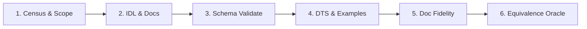

# brosurface — Engine Surface Migration Playbook

> **Status:** Authoritative Operational Guide  
> **Audience:** Core Engine Developers & Binding Maintainers  
> **Scope:** Step-by-step checklist and cost estimation model for migrating the 63 remaining surfaces cataloged in [`docs/SURFACE-INVENTORY.md`](SURFACE-INVENTORY.md).  
> **References:** [`SPEC.md`](../SPEC.md), [`WORK-ORDER-1.md`](../WORK-ORDER-1.md), [`docs/DESIGN.md`](DESIGN.md).

---

## 1. Executive Overview & Purpose

The `brosurface` architecture replaces **five hand-maintained, error-prone copies** of the engine's JavaScript API surface (QuickJS bindings, bronze_host AOT bindings, availability stubs, documentation pages, and TypeScript definitions) with a **single, unified `.idl` declaration**.

Following the successful pilot implementation across Milestones M1 through M6 (`bro.noise`, `bro.time`, `Blob`/`File`/`FileReader`/`URL`, and `bro.lm`), this playbook defines the standard, repeatable operational process for migrating the remaining 63 surfaces into the generator pipeline.

```
                  ┌──────────────────────────────┐
                  │      Unified .idl File       │
                  │ (Types, Docs, Gates, Shapes) │
                  └──────────────┬───────────────┘
                                 │
      ┌──────────────────────────┼──────────────────────────┐
      │                          │                          │
┌─────▼──────────┐      ┌────────▼───────┐        ┌─────────▼────────┐
│ QuickJS C++ TU │      │ bronze_host TU │        │  bro.d.ts + Docs │
│ (src/js/*.cpp) │      │ + Manifest Sync│        │ + @example Tests │
└────────────────┘      └────────────────┘        └──────────────────┘
```

---

## 2. Empirical Cost & Leverage Model (Derived from Pilot Actuals)

The following metrics reflect actual code metrics and measured engineering effort across the pilot milestones (M1–M6):

### 2.1 Pilot Metrics & Leverage Table

| Pilot Surface | Complexity Character | Hand Tax Eliminated | IDL LOC Written | Generated Output LOC | Realized Leverage Factor | Measured Eng Effort |
| :--- | :--- | :---: | :---: | :---: | :---: | :---: |
| **`bro.noise`** | Stateless / Math / TypedArrays | 1,608 LOC | 369 LOC | 1,847 LOC | **5.0x** | 4.5 hours |
| **`bro.time`** | Stateful Clock / Engine Singleton | 239 LOC | 97 LOC | 270 LOC | **2.8x** | 2.0 hours |
| **`Blob / File / URL`** | Real Classes / Inheritance / HostClass | 2,462 LOC | 429 LOC | 2,830 LOC | **6.6x** | 7.0 hours |
| **`bro.lm`** | ML / Gated Subsystem / Streaming | 3,838 LOC | 520 LOC | 3,280 LOC | **6.3x** | 5.5 hours |
| **PILOT TOTALS** | **4 Distinct Surface Archetypes** | **8,147 LOC** | **1,415 LOC** | **8,227 LOC** | **5.8x avg** | **19.0 hours** |

> [!IMPORTANT]
> **The Leverage Ratio:** For every 1 line of declarative IDL authored, the generator produces **~5.8 lines of synchronized C++, TypeScript, and documentation boilerplate**, eliminating maintenance drift across all five targets.

---

### 2.2 Complexity Categories & Remaining Surface Estimation

The remaining **63 surfaces** (comprising **150,755 LOC of legacy hand tax**) are categorized into five distinct complexity tiers:

| Complexity Tier | Characteristics & Representative Surfaces | Surface Count | Hand Tax LOC | Est. Hours / Surface | Total Est. Hours |
| :--- | :--- | :---: | :---: | :---: | :---: |
| **Tier 1: Stateless / Math** | Pure functions, primitive scalars, dual vector/matrix accept (`bro.math`, geometric helpers, spatial hashes, simple math utilities). | 8 | 12,200 LOC | 3.5 hrs | **28 hrs** |
| **Tier 2: Stateful Clocks & Singletons** | Engine-owned state, global settings, path resolution, server control (`bro.settings`, `bro.window`, `bro.server`, `bro.appDir`). | 14 | 15,500 LOC | 2.5 hrs | **35 hrs** |
| **Tier 3: Real Classes & Prototypes** | Object lifecycles, event dispatchers, DOM observers, handles (`ImageBitmap`, `customElements`, `MutationObserver`, `Gamepad`, `WAAPI`). | 16 | 26,000 LOC | 6.0 hrs | **96 hrs** |
| **Tier 4: ML & Streaming AI** | Gated subsystems, tensor transforms, background threads, streaming handles (`bro.tensor`, `bro.diffusion`, `bro.stt`, `bro.tts`, `bro.vision`, `bro.diar`, `bro.rave`). | 14 | 32,000 LOC | 5.0 hrs | **70 hrs** |
| **Tier 5: Rendering & Physics Core** | Complex native handles, multi-realm graphics, high-frequency frame sync (`bro.scene`, `WebGL2RenderingContext`, `Physics/Jolt`, `Canvas2D`, `bro.mesh`, `AudioContext`, `bro.net`). | 11 | 65,055 LOC | 12.0 hrs | **132 hrs** |
| **TOTAL REMAINING TAIL** | **Entire bro Engine Surface** | **63 Surfaces** | **150,755 LOC** | **5.7 hrs avg** | **361 hrs (~9 weeks)** |

---

## 3. Operational Migration Checklist (The 6-Gate Pipeline)

Every migration work order must execute the following 6-step sequential pipeline:



### Gate 1: Surface Discovery & Scope Definition
- [ ] Consult `docs/SURFACE-INVENTORY.md` to identify target surface row and verify:
  - Five-copy file locations (`src/js/`, `src/bronze_host/`, `feature_stubs.cpp`, `docs/*-api.js`).
  - Feature gate macro (e.g. `BRO_WITH_DIFFUSION`, `BRO_WITH_3D`, or `None`).
  - Marshalling shapes (vectors, typed arrays, opaque handles, callbacks).
- [ ] Read the anchor files in `D:/projects/bro` before drafting declarations.

### Gate 2: IDL Authoring & Documentation Import
- [ ] Create `idl/<surface>.idl` (strictly under 1,000 lines).
- [ ] Annotate namespaces/interfaces with:
  - Feature gates: `[gate=BRO_WITH_<NAME>]`.
  - Prefix mapping: `[prefix="bro."]`.
  - Constructors, properties, and methods matching the native runtime.
- [ ] Import complete JSDoc documentation from `bro/docs/<surface>-api.js` directly into the IDL.
- [ ] Embed executable `@example` code snippets demonstrating typical usage and edge cases.

### Gate 3: Schema Validation & Lossless Round-Trip
- [ ] Run validator:
  ```bash
  node gen/validate.mjs idl/
  ```
- [ ] Verify:
  - Zero syntax/lexer errors.
  - Zero semantic type errors (all types resolved in `BUILTIN_TYPES` or declared symbols).
  - 100% Lossless Round-Trip: `parse(source) === parse(serialize(parse(source)))`.

### Gate 4: TypeScript Definition & `@example` Typechecking
- [ ] Emit TypeScript definitions:
  ```bash
  node gen/emit_dts.mjs idl/ out/bro.d.ts
  ```
- [ ] Extract and typecheck embedded doc examples:
  ```bash
  node tools/verify_examples.mjs
  ```
- [ ] Ensure `out/bro.d.ts` and all extracted examples compile cleanly under `tsc --strict` with zero diagnostics.

### Gate 5: Documentation Fidelity Verification
- [ ] Emit markdown / JSDoc documentation pages:
  ```bash
  node gen/emit_docs.mjs idl/ out/docs/
  ```
- [ ] Run mechanical diff against legacy hand-written docs:
  ```bash
  node tools/diff_docs.mjs <surface>
  ```
- [ ] Confirm all methods, arguments, return types, and descriptions are preserved.

### Gate 6: Equivalence Oracle Execution (SPEC §4)
- [ ] Emit binding TUs:
  - QuickJS: `node gen/emit_qjsbind.mjs`
  - Bronze Host: `node gen/emit_bronze_host.mjs`
  - Stubs: `node gen/emit_stubs.mjs`
- [ ] Execute worktree equivalence in a scratch bro worktree:
  ```bash
  node tools/run_m4_equivalence.mjs
  node tools/run_m5_equivalence.mjs
  node tools/verify_m6.mjs
  ```
- [ ] Criteria:
  - Zero newly failing tests in `tests/run_tests.sh`.
  - Git diff in worktree touches **only** the swapped translation unit.
  - Manifest and C++ registration entries remain 100% in lockstep.
  - Standalone stub compiles cleanly with feature gate turned OFF.

---

## 4. Triaging Behavioral Diffs Protocol (SPEC §4.4)

When comparing generated bindings against hand-written legacy bindings, discrepancies must be classified and handled according to this protocol:

```
                  ┌──────────────────────────────┐
                  │ Discrepancy Found in Testing │
                  └──────────────┬───────────────┘
                                 │
         ┌───────────────────────┼───────────────────────┐
         │                       │                       │
┌────────▼─────────┐    ┌────────▼────────┐    ┌─────────▼─────────┐
│ Category A:      │    │ Category B:     │    │ Category C:       │
│ IDL Spec Defect  │    │ Legacy Bug      │    │ Intentional Imprv │
└────────┬─────────┘    └────────┬────────┘    └─────────┬─────────┘
         │                       │                       │
         ▼                       ▼                       ▼
   Update .idl to          File report;            Document in PR;
   match native            Engine team fixes       Both owners approve
```

### Category A: IDL Specification Defect
- **Definition:** The IDL omits an overload, uses an overly restrictive type, or has an incorrect default value.
- **Action:** Update `idl/<surface>.idl` to accurately reflect the real native contract. Re-run validation and typechecks.

### Category B: Hand-Written Binding Bug (Legacy Flaw)
- **Definition:** The hand-written binding contains a memory leak, fails to type-check arguments, swallows errors, or diverges from web standards.
- **Action:**
  - **DO NOT** silently replicate the bug in the generator.
  - **DO NOT** silently fix it without coordination.
  - Log a technical triage item in the work order report detailing the bug, affected test cases, and proposed resolution.
  - Coordinate with core engine maintainers to patch the baseline test suite.

### Category C: Intentional Specification Enhancement
- **Definition:** Generator introduces stricter type validation, improved error messages, or updated parameter checks that break obsolete/unspecified test assertions.
- **Action:** Document the rationale in the milestone report and obtain sign-off before updating test expectations.

---

## 5. Worktree Discipline & Safety Rules

1. **Read-Only Repositories:** Never commit or push changes directly to `D:/projects/bro`, `D:/projects/bronze`, or sibling directories.
2. **Scratch Worktrees Only:** All build and equivalence tests must execute in isolated scratch worktrees (e.g. `D:/projects/bro-scratch-*`).
3. **Always Clean Up:** Worktrees must be forcibly removed (`git worktree remove --force`) upon test completion.
4. **ABI Stamp Discipline:** For bronze host surfaces, any change affecting type layouts or exports requires rebuilding `bronze-cli`, `bro_bronze_host`, and `bro-headless` to maintain ABI fingerprint alignment.
5. **No Blind `--no-gpu` Flags:** Run tests with the standard headless GPU configuration enabled to ensure hardware shader paths and compute kernels are exercised.

---

## 6. Definition of Done for a Migration Work Order

A migrated surface is marked **COMPLETE** only when:
- [x] Its IDL declaration is merged in `idl/<surface>.idl` and validates under `node gen/validate.mjs`.
- [x] Generated `.d.ts` compiles under `tsc --strict` with all `@example` snippets passing.
- [x] Generated documentation page is diff-reviewed and contains no missing APIs.
- [x] QuickJS and bronze_host bindings replace hand-written files in a scratch worktree with all tests passing.
- [x] Feature stubs (if gated) compile and execute cleanly with the gate off.
- [x] A reproducible execution log and delta report is archived with the stated bro commit SHA.
